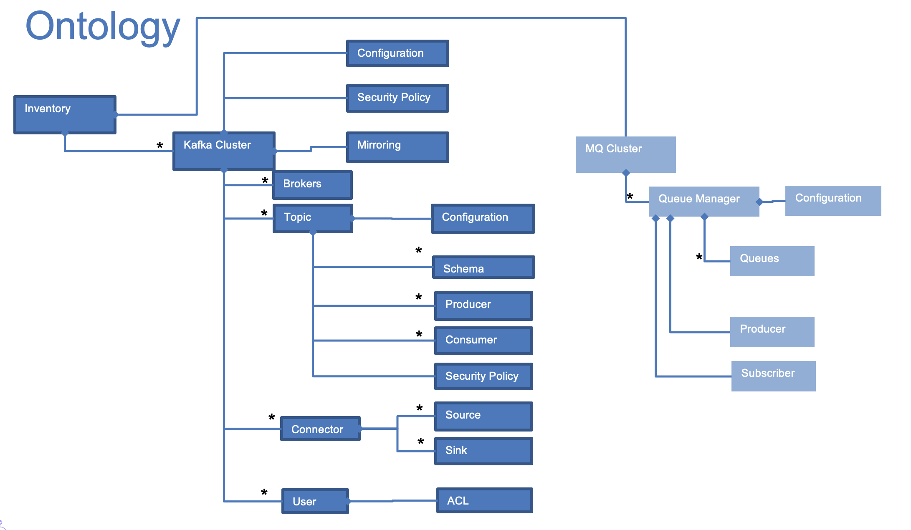

# [Event-Driven solution governance](https://jbcodeforce.github.io/eda-governance)

This project defines tools and metadata to manage event-driven solutions. The metadata ontology includes at least the following elements:

.

The diagram should be self explanatory. 

In this current implementation, we want to illustrate how to define the following Kafka components using Apache Atlas:

* Cluster
* Brokers belonging to a cluster
* Topics beloging to one to many clusters
* Producer and consumer apps connected to one or more topics

See [book format](https://jbcodeforce.github.io/eda-governance)

