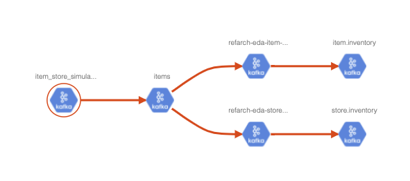

# Demonstration

* Start Atlas locally: `docker-compose -f environment/atlas/docker-compose up -d`
* Upload type definitions in the following order: This can also be done in one command: `./scripts/uploadTypeDef.sh`

```sh
# Brokers
./scripts/uploadTypeDef.sh catalog/types/kafka/kafka_broker_def.json
# Kafka Cluster
./scripts/uploadTypeDef.sh catalog/types/kafka/kafka_cluster_def.json 
# Topics
./scripts/uploadTypeDef.sh catalog/types/kafka/kafka_topic_def.json
# Applications
./scripts/uploadTypeDef.sh catalog/types/kafka/kafka_app_def.json
```

*In case you need to delete a type definition use*: `./scripts/deleteTypeDef.sh <typename>`. 

* Upload entities definitions for each of the elements for the Inventory management demo. 
This can be done in one run: `./scripts/uploadEntityDef.sh` or one by one:

```sh
# Upload brokers
./scripts/uploadEntityDef.sh catalog/entities/kafka/kafka_brokers.json
# Upload two clusters
./scripts/uploadEntityDef.sh catalog/entities/kafka/kafka_eda_dev_cluster.json 
./scripts/uploadEntityDef.sh catalog/entities/kafka/kafka_strimzi_cluster.json
# Upload topics
./scripts/uploadEntityDef.sh catalog/entities/kafka/kafka_topics.json
# Upload apps
./scripts/uploadEntityDef.sh catalog/entities/kafka/kafka_apps.json
```


* Go to the Atlas UI to navigate into the [localhost:21000](http://localhost:21000):

On the left side, select the entities and scroll down to see Kafka services:


* Start to select the cluster, you should see the list of Kafka cluster instances:


* Select the `eda-dev` Kafka Cluster, you should see all the metadata of the cluster:


* Select one of the broker this cluster includes: you should get the metadata of the broker: 


* By selecting the `eda_kafka_broker` we can get the list of broker cross clusters:


* Same for the `eda_kafka_topic` we can see all the topics with the related cluster.


* The topic details:


* Finally some event-driven applications are defined and we can see the list of those applications with the reference to 
the namespace and OpenShift cluster name as well as the type of Kafka Application


* A more detail list of app's attributes 


* And finally the static view of who produce what to where:

